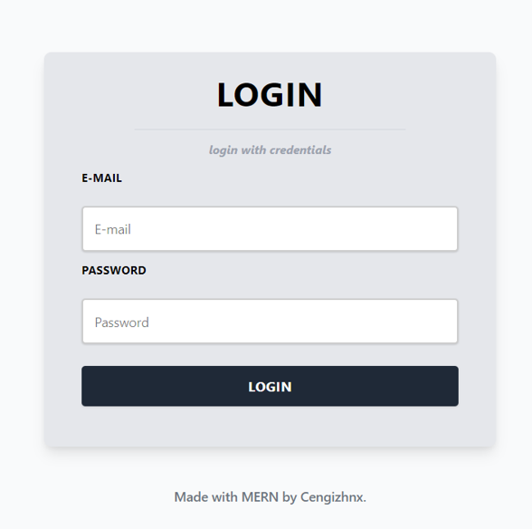
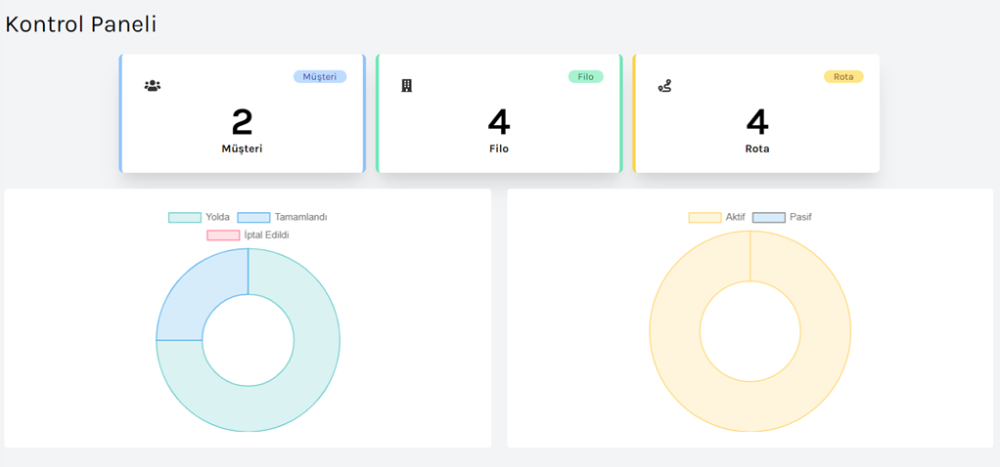
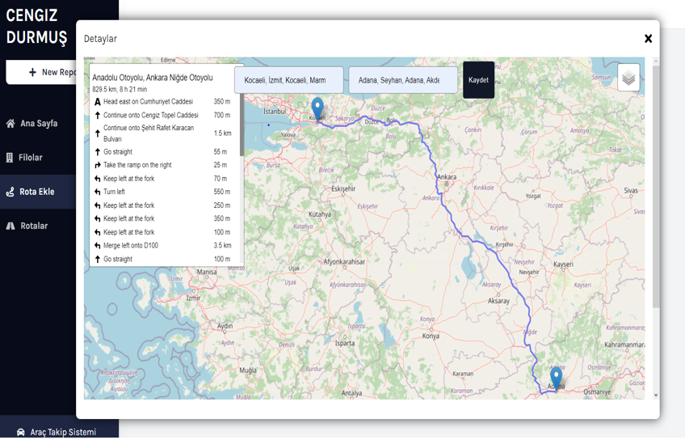
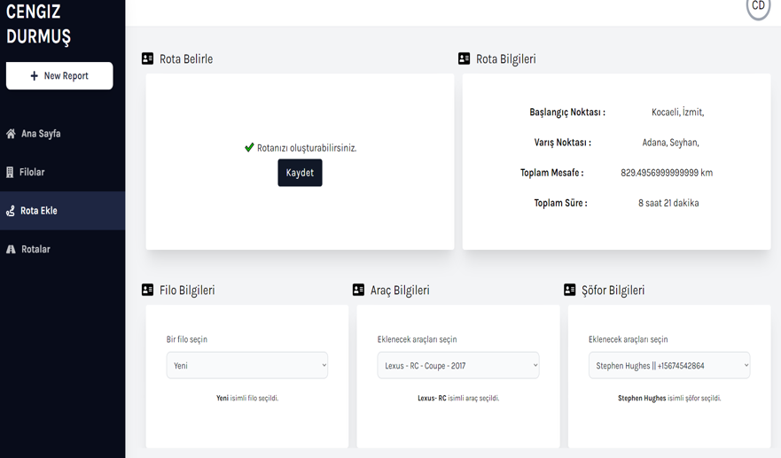
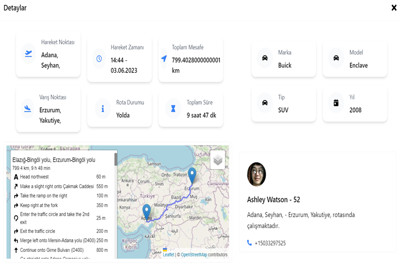
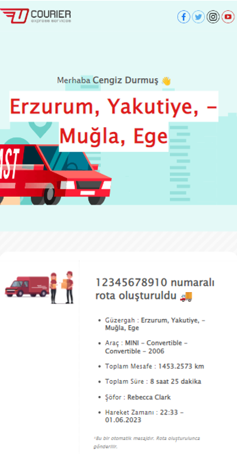
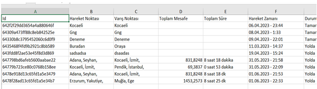

# MERN - Vehicle Tracking Fleet Management

🗺️Users can choose a starting and destination point. After filling in the fields, it is based on creating a route by choosing the desired vehicle and driver in the desired fleet.

## Login

Login page for client and admin.

## Statistic

Customer, fleet, route numbers and statuses are shown in graphics on the admin page.

## Route

Start and destination information is retrieved from the user using the React Leaflet library.

After all fields are filled, the route is ready.

After the route is created, route details can be accessed from the routes page.

## E-mail

After the route is created, a notification e-mail is sent to the customer's e-mail address.

## Excel

All routes created by the customer can be saved and downloaded in the excel table.

## ✨ Technologies

- MongoDB
- Express JS
- React - Redux
- Node JS
- Tailwind CSS
- React Chart JS